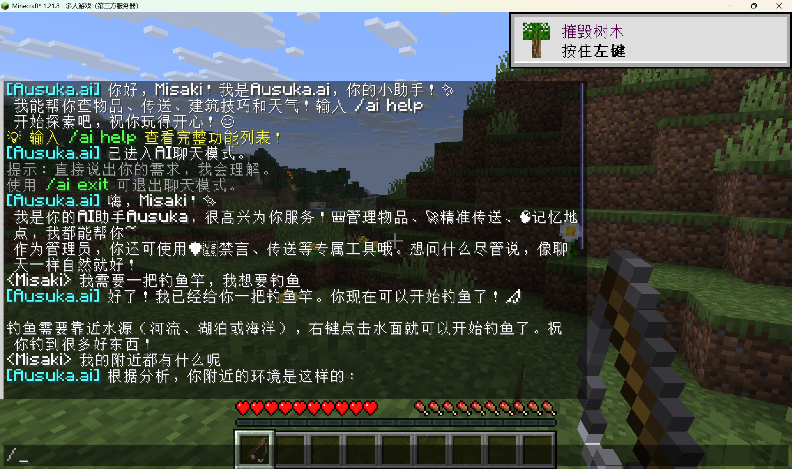
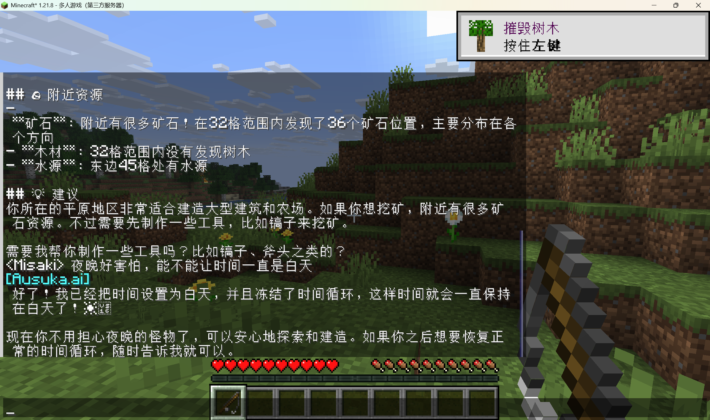

# Keira (Minecraft Fabric Mod)

  

  
  
  

<small><em>Note: This project was renamed from "Ausuka.ai" to "Keira".</em></small>

Keira is an in‑game AI assistant for Minecraft — a friendly “Jarvis”-like companion that understands what you say and helps you play, build, explore, and manage your world.

Community server: `114.67.97.163:25565` (Fabric 1.21.8, whitelist on, online‑mode off).

## Screenshots

  
  

## What It Can Do
- Chat naturally and get concise, localized replies.
- Help with survival basics: finding resources, travel and navigation, weather/time, clearing negative effects, quick recovery.
- Assist building and exploration: suggest ideas, mark and recall important locations, offer world context.
- Light server guidance: gentle reminders, tips, and optional moderation aids for admins.

## Quick Start
- Requirements: Fabric 1.21.8, Fabric API, Java 21
- Client (PCL):
  1) Create a Fabric 1.21.8 instance in PCL (PCL2)
  2) Put Fabric API and this mod jar into that instance’s `mods/`
  3) Launch and use `/ai help`, `/ai chat`, or `/ai say <message>`
- Dedicated server:
  1) Install Fabric Loader 1.21.8 and Fabric API
  2) Drop the mod jar into `mods/`
  3) Start with Java 21

## Configure (Short & Simple)
- Set your AI key once. Easiest: create `<.minecraft>/config/keira.properties` and put your key in it.
- Works with mainstream providers. You can also use environment variables or JVM args if you prefer.
- Replies follow each player’s client language; the server language is `en_us`.

## Notes
- Designed to be safe for servers and friendly for players.
- Sessions and memories persist across restarts.
